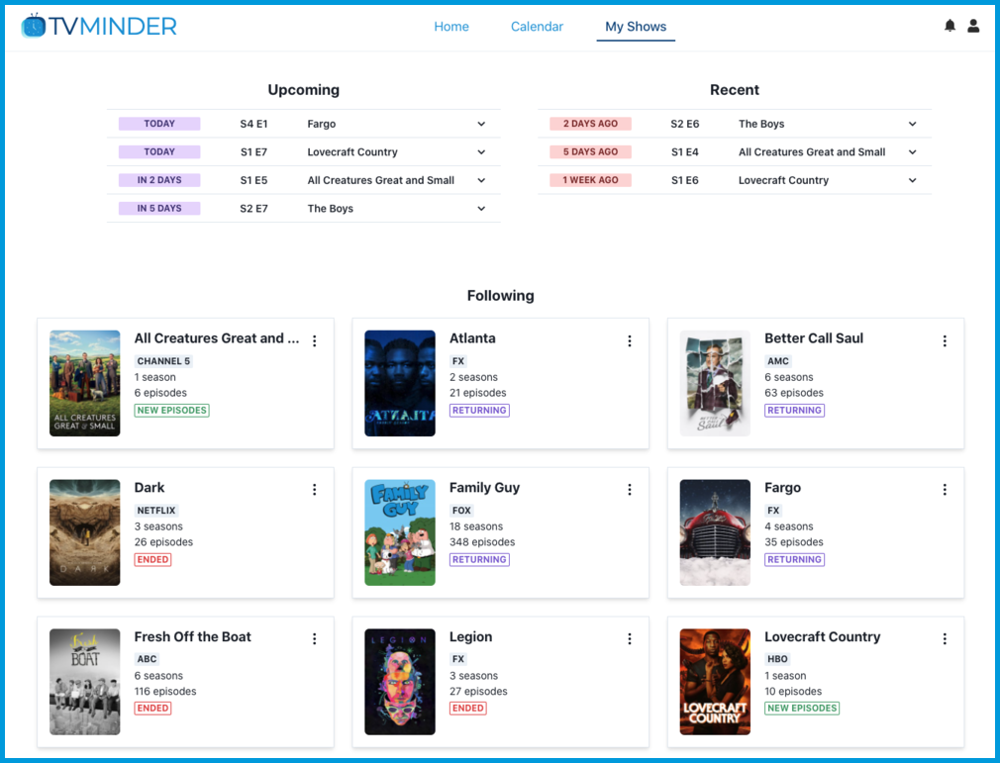

# TV-Minder

> Full-stack web application to keep track of your favorite shows

 

## Technologies

**Front**: React, Redux, TypeScript, Chakra UI

**API**: Express, TypeScript, Docker, AWS ECS

## Local Development

From the root directory:

- Run `yarn`
- Start the front end: `yarn start`
- Optionally start the back end: `yarn serve`
  - Note: If you are just working on the front-end, you don't need to run the back-end since the local project is set to use the deployed API. If you want to work with the local API, change [this](https://github.com/trybick/tv-minder/blob/master/front/src/utils/constants.ts) file and request the env files for the api folder in an issue.

## Contributing 😎

Thanks for your interest! Please keep the following in mind. Please reference our [GitHub Issues page](https://github.com/trybick/tv-minder/issues) and feel free to create new issues for feature requests or bug fixes.

- Fork the repo and create your branch from `master`.
- Target the master branch for new pull requests.
- Create an issue on GitHub or make sure you're assigned an existing one.
- Open a PR and post comments on your PR for tricky areas to help reviewers.
- On your pull request, ensure the Netlify build succeeds.
