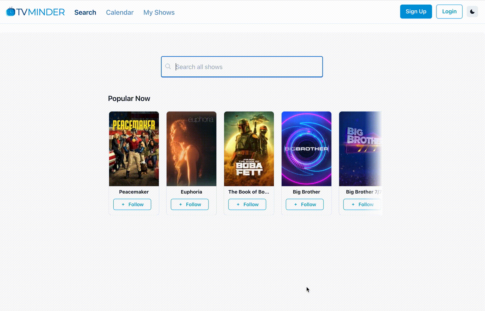

# TV-Minder

> Full-stack web application to keep track of your favorite shows

[](https://app.netlify.com/sites/tv-minder/deploys) [](https://github.com/trybick/tv-minder/actions/workflows/front-validate.yml)

## Demo

<p align="center">

</p>

## Technologies

**Front**: React, Redux, TypeScript, Chakra UI

**API**: Node.js, Express, MongoDB Atlas, TypeScript

## Local Development

#### Using the production API (quickest)

This will start the front-end and use the production API for API requests so you don't need to run the local API.

```bash
yarn
yarn start
```

#### Or run the API locally if preferred

```bash
# Start the local API
yarn serve:local
# Start the app
yarn start:local
```

#### ENV Files

- All ENV files on the frontend are checked into git, except for the google OAuth token. If you need to use Google OAuth locally, then create a file `front/.env.local` which contains `VITE_GOOGLE_OAUTH_CLIENT_ID`.

## Contributing 😎

See [Contribution guidelines](https://github.com/trybick/tv-minder/blob/master/CONTRIBUTING.md)
