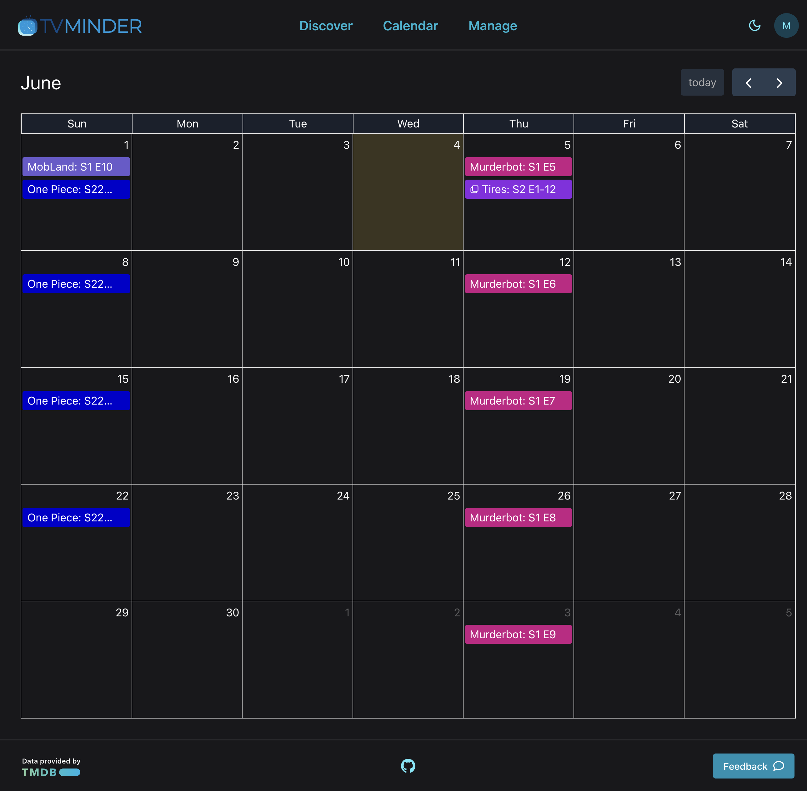

# TV-Minder

[](https://app.netlify.com/sites/tv-minder/deploys) [](https://github.com/trybick/tv-minder/actions/workflows/front-validate.yml) [](https://github.com/trybick/tv-minder/actions/workflows/e2e-tests.yml)

See new episodes of your favorite shows on a calendar like this:

<p align="center">

</p>

# Technologies

**Front**: Vite, React, Redux, TypeScript, Chakra UI

**API**: Node.js, Express, MongoDB Atlas, TypeScript

# Local Development

### Using the production API (quickest)

This will start the front-end and use the production API for API requests so you don't need to run the local API.

```bash
npm install
npm start
```

### Or run the API locally if preferred

```bash
# Start the local API
npm run serve:local
# Start the app
npm run start:local
```

### ENV Files

All ENV files on the frontend are checked into git, except for the google OAuth token. If you need to use Google OAuth locally, then create a file `front/.env.local` which contains `VITE_GOOGLE_OAUTH_CLIENT_ID`.

# Testing

### E2E Tests

There is a comprehensive set of e2e tests that test many core features. To run the e2e tests:

```bash
npm run start
npx playwright install
npm run test:e2e:ui
```

### Unit Tests

There are a few unit tests for the most important logic. They use vitest and can be run with:

```bash
npm run test
```
